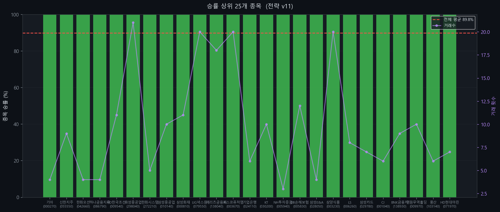

# KOSPI 200 유니버설 전략 v11

> 최적화 기준: KOSPI 200 전 종목 합산 승률 최대화
> 생성일: 2026-04-13 17:35 | 사이클: 1

---

## 전략 개요

| 항목 | 내용 |
|------|------|
| 전략 유형 | Breakout |
| 백테스팅 기간 | 2018-01-01 ~ 2024-12-31 |
| 대상 | KOSPI 200 전 종목 |
| 최적화 기준 | 전 종목 합산 승률 |

---

## 성과 지표

| 지표 | 값 |
|------|----|
| **전체 승률** | **89.8%** |
| Profit Factor | 10.00 |
| 평균 CAGR | +0.4% |
| 평균 MDD | -6.8% |
| 총 거래 횟수 | 618회 |
| 적용 종목 수 | 58/200개 |

---

## 진입 조건

1. 종가 > 1000일 최고가 (채널 돌파)

## 청산 조건

1. 종가 < 300일 최저가
2. ATR 손절: 진입가 - 14.0 x ATR (트레일링)
3. 이익 목표: 진입가 + 0.5 x ATR 도달 시 청산

---

## 파라미터

| 파라미터 | 값 |
|---------|-----|
| entry_window | 1000 |
| exit_window | 300 |
| trail_mult | 14.0 |
| profit_target_mult | 0.5 |
| volume_ratio | 1.0 |
| invest_pct | 0.3 |
| rsi_filter | 0 |
| adx_filter | 0 |
| trend_filter | 0 |

---

## 승률 상위 20개 종목

| 티커 | 종목명 | 승률 | 거래수 | PF | CAGR |
|------|--------|------|--------|-----|------|
| 000270 | 기아 | 100.0% | 4 | 10.00 | +0.5% |
| 055550 | 신한지주 | 100.0% | 9 | 10.00 | -0.4% |
| 042660 | 한화오션 | 100.0% | 4 | 10.00 | +0.5% |
| 086790 | 하나금융지주 | 100.0% | 4 | 10.00 | +0.4% |
| 009540 | HD한국조선해양 | 100.0% | 11 | 10.00 | +0.6% |
| 298040 | 효성중공업 | 100.0% | 21 | 10.00 | +2.4% |
| 272210 | 한화시스템 | 100.0% | 5 | 10.00 | -1.1% |
| 010140 | 삼성중공업 | 100.0% | 10 | 10.00 | +0.9% |
| 000810 | 삼성화재 | 100.0% | 11 | 10.00 | -0.0% |
| 079550 | LIG넥스원 | 100.0% | 20 | 10.00 | +2.1% |
| 138040 | 메리츠금융지주 | 100.0% | 18 | 10.00 | +0.8% |
| 003670 | 포스코퓨처엠 | 100.0% | 20 | 10.00 | +2.8% |
| 024110 | 기업은행 | 100.0% | 6 | 10.00 | +0.6% |
| 030200 | KT | 100.0% | 10 | 10.00 | +0.6% |
| 005940 | NH투자증권 | 100.0% | 3 | 10.00 | -0.1% |
| 005830 | DB손해보험 | 100.0% | 12 | 10.00 | +1.0% |
| 028050 | 삼성E&A | 100.0% | 4 | 10.00 | +0.4% |
| 003230 | 삼양식품 | 100.0% | 20 | 10.00 | +1.2% |
| 006260 | LS | 100.0% | 8 | 10.00 | +2.4% |
| 029780 | 삼성카드 | 100.0% | 7 | 10.00 | -0.2% |

---

## 차트

### 사이클별 성과 비교

### 라운드별 승률 추이

### 커버리지 vs 승률

### 파라미터별 평균 승률

### 상위 종목 승률

