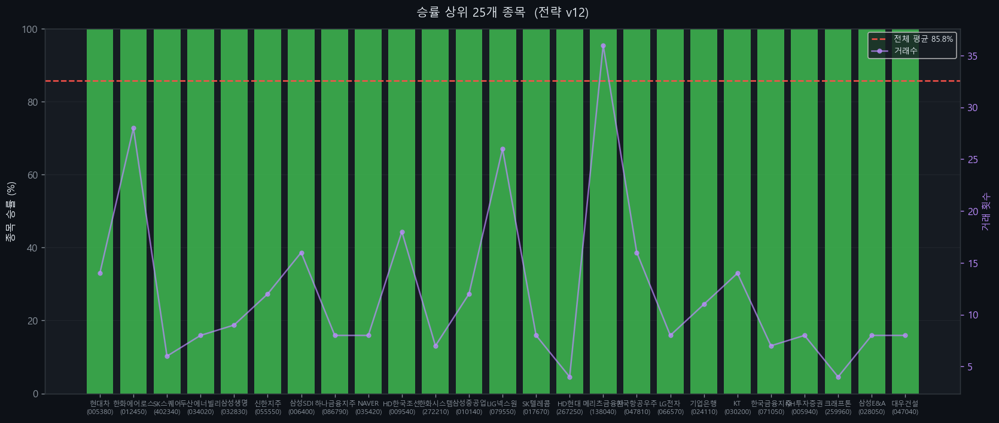

# KOSPI 200 유니버설 전략 v12

> 최적화 기준: KOSPI 200 전 종목 합산 승률 최대화
> 생성일: 2026-04-13 17:46 | 사이클: 1

---

## 전략 개요

| 항목 | 내용 |
|------|------|
| 전략 유형 | Breakout |
| 백테스팅 기간 | 2018-01-01 ~ 2024-12-31 |
| 대상 | KOSPI 200 전 종목 |
| 최적화 기준 | 전 종목 합산 승률 |

---

## 성과 지표

| 지표 | 값 |
|------|----|
| **전체 승률** | **85.8%** |
| Profit Factor | 10.00 |
| 평균 CAGR | +0.4% |
| 평균 MDD | -10.3% |
| 총 거래 횟수 | 1,773회 |
| 적용 종목 수 | 150/200개 |

---

## 진입 조건

1. 종가 > 520일 최고가 (채널 돌파)
2. 거래량 > 1.3x 평균거래량

## 청산 조건

1. 종가 < 170일 최저가
2. ATR 손절: 진입가 - 15.0 x ATR (트레일링)
3. 이익 목표: 진입가 + 0.3 x ATR 도달 시 청산

---

## 파라미터

| 파라미터 | 값 |
|---------|-----|
| entry_window | 520 |
| exit_window | 170 |
| trail_mult | 15.0 |
| profit_target_mult | 0.3 |
| volume_ratio | 1.3 |
| invest_pct | 0.45 |
| rsi_filter | 0 |
| adx_filter | 0 |
| trend_filter | 0 |

---

## 승률 상위 20개 종목

| 티커 | 종목명 | 승률 | 거래수 | PF | CAGR |
|------|--------|------|--------|-----|------|
| 005380 | 현대차 | 100.0% | 14 | 10.00 | +1.2% |
| 012450 | 한화에어로스페이스 | 100.0% | 28 | 10.00 | +4.7% |
| 402340 | SK스퀘어 | 100.0% | 6 | 10.00 | +1.2% |
| 034020 | 두산에너빌리티 | 100.0% | 8 | 10.00 | +2.5% |
| 032830 | 삼성생명 | 100.0% | 9 | 10.00 | +0.6% |
| 055550 | 신한지주 | 100.0% | 12 | 10.00 | +1.1% |
| 006400 | 삼성SDI | 100.0% | 16 | 10.00 | +2.1% |
| 086790 | 하나금융지주 | 100.0% | 8 | 10.00 | +0.6% |
| 035420 | NAVER | 100.0% | 8 | 10.00 | +0.4% |
| 009540 | HD한국조선해양 | 100.0% | 18 | 10.00 | +1.7% |
| 272210 | 한화시스템 | 100.0% | 7 | 10.00 | -1.0% |
| 010140 | 삼성중공업 | 100.0% | 12 | 10.00 | +0.5% |
| 079550 | LIG넥스원 | 100.0% | 26 | 10.00 | +4.3% |
| 017670 | SK텔레콤 | 100.0% | 8 | 10.00 | +0.3% |
| 267250 | HD현대 | 100.0% | 4 | 10.00 | +0.4% |
| 138040 | 메리츠금융지주 | 100.0% | 36 | 10.00 | +3.3% |
| 047810 | 한국항공우주 | 100.0% | 16 | 10.00 | +0.9% |
| 066570 | LG전자 | 100.0% | 8 | 10.00 | +0.8% |
| 024110 | 기업은행 | 100.0% | 11 | 10.00 | -0.1% |
| 030200 | KT | 100.0% | 14 | 10.00 | +0.5% |

---

## 차트

### 사이클별 성과 비교

### 라운드별 승률 추이

### 커버리지 vs 승률

### 파라미터별 평균 승률

### 상위 종목 승률

