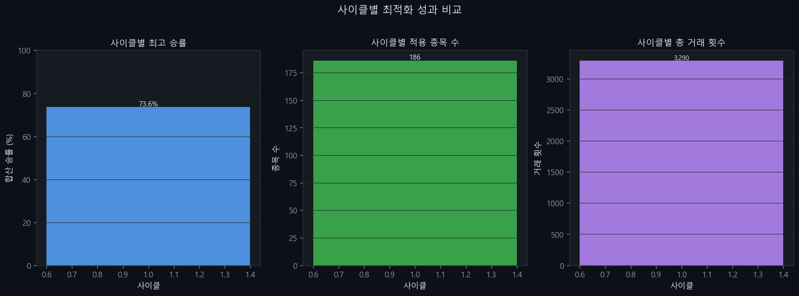
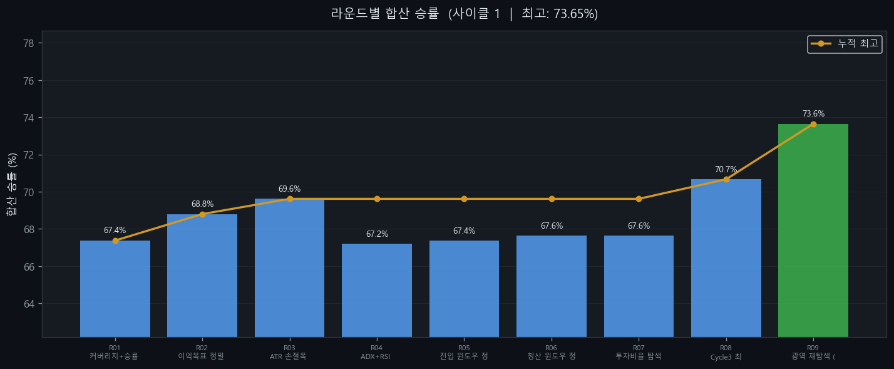
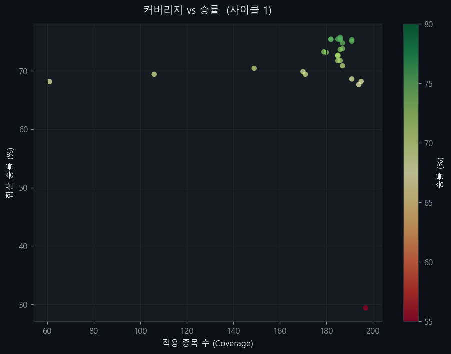
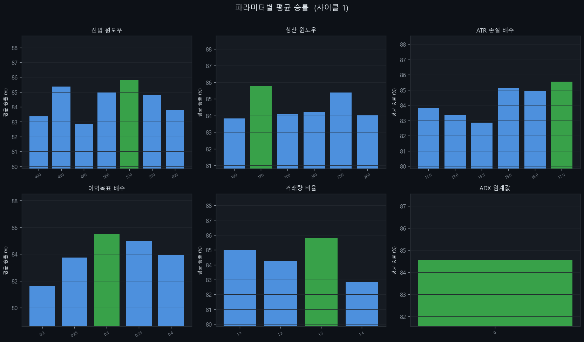

# KOSPI 200 유니버설 전략 v19

> 최적화 기준: KOSPI 200 전 종목 합산 승률 최대화
> 생성일: 2026-04-13 19:06 | 사이클: 1

---

## 전략 개요

| 항목 | 내용 |
|------|------|
| 전략 유형 | Breakout |
| 백테스팅 기간 | 2018-01-01 ~ 2026-03-31 |
| 대상 | KOSPI 200 전 종목 |
| 최적화 기준 | 전 종목 합산 승률 |

---

## 성과 지표

| 지표 | 값 |
|------|----|
| **전체 승률** | **90.5%** |
| Profit Factor | 10.00 |
| 평균 CAGR | +0.8% |
| 평균 MDD | -13.5% |
| 총 거래 횟수 | 2,750회 |
| 적용 종목 수 | 171/200개 |

---

## 진입 조건

1. 종가 > 550일 최고가 (채널 돌파)
2. 거래량 > 1.2x 평균거래량

## 청산 조건

1. 종가 < 260일 최저가
2. ATR 손절: 진입가 - 40.0 x ATR (트레일링)
3. 이익 목표: 진입가 + 0.7 x ATR 도달 시 청산

---

## 파라미터

| 파라미터 | 값 |
|---------|-----|
| entry_window | 550 |
| exit_window | 260 |
| trail_mult | 40.0 |
| profit_target_mult | 0.7 |
| volume_ratio | 1.2 |
| invest_pct | 0.4 |
| rsi_filter | 0 |
| adx_filter | 0 |
| trend_filter | 0 |

---

## 승률 상위 20개 종목

| 티커 | 종목명 | 승률 | 거래수 | PF | CAGR |
|------|--------|------|--------|-----|------|
| 005380 | 현대차 | 100.0% | 21 | 10.00 | +0.8% |
| 012450 | 한화에어로스페이스 | 100.0% | 45 | 10.00 | +6.8% |
| 329180 | HD현대중공업 | 100.0% | 21 | 10.00 | +3.3% |
| 055550 | 신한지주 | 100.0% | 19 | 10.00 | +1.2% |
| 006400 | 삼성SDI | 100.0% | 12 | 10.00 | +1.9% |
| 006800 | 미래에셋증권 | 100.0% | 30 | 10.00 | +7.1% |
| 009540 | HD한국조선해양 | 100.0% | 31 | 10.00 | +1.7% |
| 015760 | 한국전력 | 100.0% | 17 | 10.00 | +1.3% |
| 034730 | SK | 100.0% | 13 | 10.00 | +0.8% |
| 316140 | 우리금융지주 | 100.0% | 26 | 10.00 | +2.1% |
| 010120 | LS ELECTRIC | 100.0% | 26 | 10.00 | +3.8% |
| 000810 | 삼성화재 | 100.0% | 12 | 10.00 | +1.0% |
| 096770 | SK이노베이션 | 100.0% | 4 | 10.00 | +0.9% |
| 017670 | SK텔레콤 | 100.0% | 13 | 10.00 | +1.2% |
| 066570 | LG전자 | 100.0% | 9 | 10.00 | -0.5% |
| 033780 | KT&G | 100.0% | 16 | 10.00 | +1.0% |
| 024110 | 기업은행 | 100.0% | 22 | 10.00 | +2.6% |
| 030200 | KT | 100.0% | 22 | 10.00 | +1.4% |
| 259960 | 크래프톤 | 100.0% | 4 | 10.00 | +0.7% |
| 352820 | 하이브 | 100.0% | 4 | 10.00 | +0.7% |

---

## 차트

### 사이클별 성과 비교

### 라운드별 승률 추이

### 커버리지 vs 승률

### 파라미터별 평균 승률

### 상위 종목 승률

