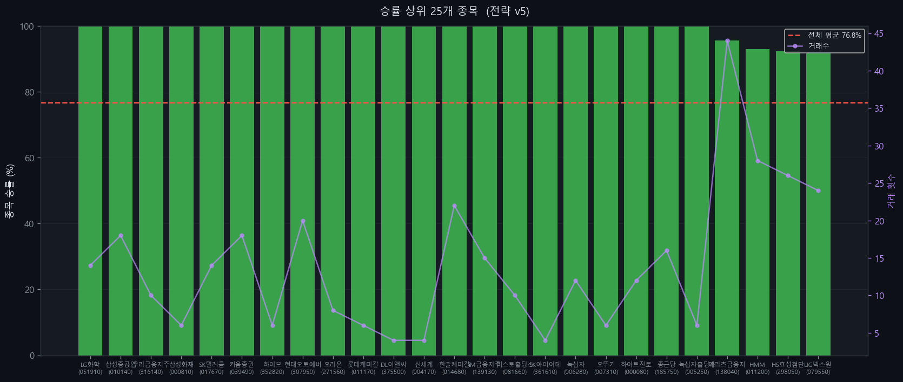

# KOSPI 200 유니버설 전략 v5

> 최적화 기준: KOSPI 200 전 종목 합산 승률 최대화
> 생성일: 2026-04-13 13:52 | 사이클: 1

---

## 전략 개요

| 항목 | 내용 |
|------|------|
| 전략 유형 | Breakout |
| 백테스팅 기간 | 2018-01-01 ~ 2024-12-31 |
| 대상 | KOSPI 200 전 종목 |
| 최적화 기준 | 전 종목 합산 승률 |

---

## 성과 지표

| 지표 | 값 |
|------|----|
| **전체 승률** | **76.8%** |
| Profit Factor | 1.18 |
| 평균 CAGR | +0.0% |
| 평균 MDD | -16.8% |
| 총 거래 횟수 | 3,097회 |
| 적용 종목 수 | 186/200개 |

---

## 진입 조건

1. 종가 > 130일 최고가 (채널 돌파)
2. 거래량 > 1.1x 평균거래량
3. ADX > 30 (추세 강도 확인)

## 청산 조건

1. 종가 < 46일 최저가
2. ATR 손절: 진입가 - 7.5 x ATR (트레일링)
3. 이익 목표: 진입가 + 0.6 x ATR 도달 시 청산

---

## 파라미터

| 파라미터 | 값 |
|---------|-----|
| entry_window | 130 |
| exit_window | 46 |
| trail_mult | 7.5 |
| profit_target_mult | 0.6 |
| volume_ratio | 1.1 |
| invest_pct | 0.6 |
| rsi_filter | 0 |
| adx_filter | 30 |
| trend_filter | 0 |

---

## 승률 상위 20개 종목

| 티커 | 종목명 | 승률 | 거래수 | PF | CAGR |
|------|--------|------|--------|-----|------|
| 051910 | LG화학 | 100.0% | 14 | 10.00 | +3.6% |
| 010140 | 삼성중공업 | 100.0% | 18 | 10.00 | +3.4% |
| 316140 | 우리금융지주 | 100.0% | 10 | 10.00 | +0.9% |
| 000810 | 삼성화재 | 100.0% | 6 | 10.00 | +0.6% |
| 017670 | SK텔레콤 | 100.0% | 14 | 10.00 | +1.0% |
| 039490 | 키움증권 | 100.0% | 18 | 10.00 | +3.5% |
| 352820 | 하이브 | 100.0% | 6 | 10.00 | +2.2% |
| 307950 | 현대오토에버 | 100.0% | 20 | 10.00 | +4.8% |
| 271560 | 오리온 | 100.0% | 8 | 10.00 | +1.3% |
| 011170 | 롯데케미칼 | 100.0% | 6 | 10.00 | +0.8% |
| 375500 | DL이앤씨 | 100.0% | 4 | 10.00 | +0.0% |
| 004170 | 신세계 | 100.0% | 4 | 10.00 | +0.8% |
| 014680 | 한솔케미칼 | 100.0% | 22 | 10.00 | +3.8% |
| 139130 | iM금융지주 | 100.0% | 15 | 10.00 | +1.2% |
| 081660 | 미스토홀딩스 | 100.0% | 10 | 10.00 | +1.5% |
| 361610 | SK아이이테크놀로지 | 100.0% | 4 | 10.00 | +2.4% |
| 006280 | 녹십자 | 100.0% | 12 | 10.00 | +3.3% |
| 007310 | 오뚜기 | 100.0% | 6 | 10.00 | +0.4% |
| 000080 | 하이트진로 | 100.0% | 12 | 10.00 | +1.3% |
| 185750 | 종근당 | 100.0% | 16 | 10.00 | +6.1% |

---

## 차트

### 사이클별 성과 비교

### 라운드별 승률 추이

### 커버리지 vs 승률

### 파라미터별 평균 승률

### 상위 종목 승률

