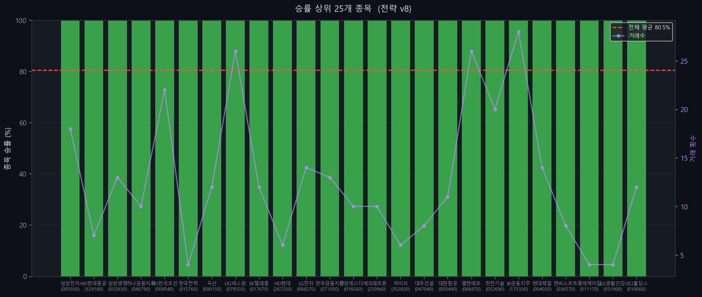

# KOSPI 200 유니버설 전략 v8

> 최적화 기준: KOSPI 200 전 종목 합산 승률 최대화
> 생성일: 2026-04-13 17:03 | 사이클: 1

---

## 전략 개요

| 항목 | 내용 |
|------|------|
| 전략 유형 | Breakout |
| 백테스팅 기간 | 2018-01-01 ~ 2024-12-31 |
| 대상 | KOSPI 200 전 종목 |
| 최적화 기준 | 전 종목 합산 승률 |

---

## 성과 지표

| 지표 | 값 |
|------|----|
| **전체 승률** | **80.5%** |
| Profit Factor | 1.40 |
| 평균 CAGR | +0.1% |
| 평균 MDD | -15.4% |
| 총 거래 횟수 | 2,730회 |
| 적용 종목 수 | 181/200개 |

---

## 진입 조건

1. 종가 > 240일 최고가 (채널 돌파)
2. 거래량 > 1.5x 평균거래량

## 청산 조건

1. 종가 < 100일 최저가
2. ATR 손절: 진입가 - 9.0 x ATR (트레일링)
3. 이익 목표: 진입가 + 0.4 x ATR 도달 시 청산

---

## 파라미터

| 파라미터 | 값 |
|---------|-----|
| entry_window | 240 |
| exit_window | 100 |
| trail_mult | 9.0 |
| profit_target_mult | 0.4 |
| volume_ratio | 1.5 |
| invest_pct | 0.6 |
| rsi_filter | 0 |
| adx_filter | 0 |
| trend_filter | 0 |

---

## 승률 상위 20개 종목

| 티커 | 종목명 | 승률 | 거래수 | PF | CAGR |
|------|--------|------|--------|-----|------|
| 005930 | 삼성전자 | 100.0% | 18 | 10.00 | +1.7% |
| 329180 | HD현대중공업 | 100.0% | 7 | 10.00 | +1.0% |
| 032830 | 삼성생명 | 100.0% | 13 | 10.00 | +1.2% |
| 086790 | 하나금융지주 | 100.0% | 10 | 10.00 | +1.1% |
| 009540 | HD한국조선해양 | 100.0% | 22 | 10.00 | +2.5% |
| 015760 | 한국전력 | 100.0% | 4 | 10.00 | +1.4% |
| 000150 | 두산 | 100.0% | 12 | 10.00 | +5.9% |
| 079550 | LIG넥스원 | 100.0% | 26 | 10.00 | +8.2% |
| 017670 | SK텔레콤 | 100.0% | 12 | 10.00 | +0.6% |
| 267250 | HD현대 | 100.0% | 6 | 10.00 | +1.7% |
| 066570 | LG전자 | 100.0% | 14 | 10.00 | +2.3% |
| 071050 | 한국금융지주 | 100.0% | 13 | 10.00 | +1.0% |
| 018260 | 삼성에스디에스 | 100.0% | 10 | 10.00 | +1.3% |
| 259960 | 크래프톤 | 100.0% | 10 | 10.00 | +3.6% |
| 352820 | 하이브 | 100.0% | 6 | 10.00 | +0.6% |
| 047040 | 대우건설 | 100.0% | 8 | 10.00 | +1.4% |
| 003490 | 대한항공 | 100.0% | 11 | 10.00 | +0.3% |
| 066970 | 엘앤에프 | 100.0% | 26 | 10.00 | +7.9% |
| 052690 | 한전기술 | 100.0% | 20 | 10.00 | +5.5% |
| 175330 | JB금융지주 | 100.0% | 28 | 10.00 | +2.9% |

---

## 차트

### 사이클별 성과 비교

### 라운드별 승률 추이

### 커버리지 vs 승률

### 파라미터별 평균 승률

### 상위 종목 승률

